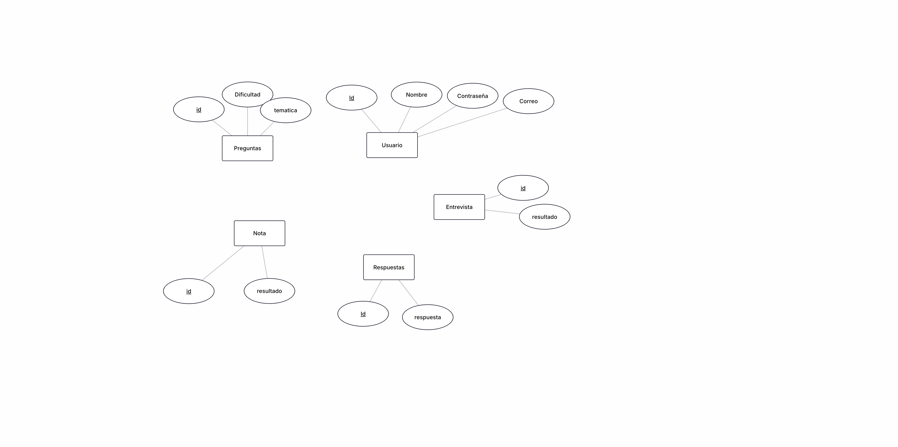
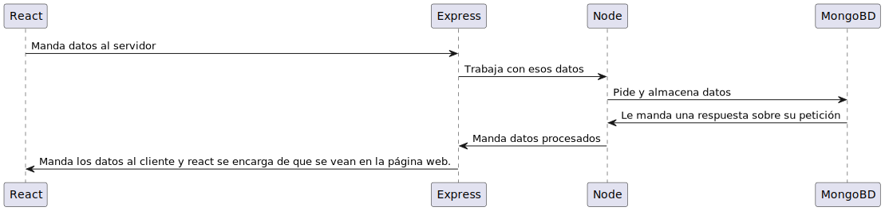

# Análisis de requisitos funcionales:

## Listad las funcionalidades principales.

- Permitir que el usuario pueda hablar y que obtenga una respuesta en función a esa conversación.
- El programa debería darle una retroalimentación al usuario de los errores que ha cometido.
- El programa debería tener una lógica que permita saber al agente de inteligencia artificial saber cuando se debería tener.
- El pograma podría tener una opción para activar un retrato facial imitando el comportamiento humano para que el usuario pueda ponerse en situación más facilmente.

## Priorizadlas usando el método MoSCoW (Must have, Should have, Could have, Won't have).

#### Debe tener
- El programa debe tener una opción que permita al usuario hablar y obtener una respuesta en función a esa conversación.
- El programa debe dar una retroalimentación al usuario de los errores que ha cometido.

### Debería tener
- El programa podría tener una lógica que permita saber al agente de inteligencia artificial saber cuando se debería detener la conversación.

### Podría tener
- El pograma podría tener una opción para activar un retrato facial imitando el comportamiento humano para que el usuario pueda ponerse en situación más facilmente.

## Definid el MVP (Producto Mínimo Viable).
El producto mínimo viable de nuestra aplicación sería permitir que el usuario pudiera realizar pruebas de entrevistas de trabajo por medio oral y que el programa pudiera recopilar esa información dada por la conversación del usuario y mediante  agentes de inteligencia ártificial. La forma de mostrar los resultados podrían ser mediante texto o voz pero de momento podría ser texto ya que lo importante es que el usuario se pueda comunicar con la voz. El punto clave es que el programa debería ser capaz de comunicarse con el usuario por medio de preguntas y que el usuario pueda responderle por medio de voz y recopilando todo lo que dice incluso las muletillas que tenga mientras habla incluso el tiempo que tarda pensando, ya que el objetivo es ser críticos igual que pasaría en una entrevista de trabajo.

## Análisis de requisitos técnicos:

### Frontend (React): ¿Qué bibliotecas adicionales necesitaréis? (routing, state management, UI components, etc.)

- **react-media-recorder** Usada para la grabación de audios 
- **axios** Usada para conectar el frontend con el backend
- **Material-UI** Usada para usar componentes predefinidos para facilitarnos el trabajo ya que tenemos poco tiempo.
- **react-router-dom** Usada para permitir que la página web pueda simular varías páginas y deje de ser una SPA.

### Backend (Node.js + Express): ¿Qué APIs o servicios externos integraréis? ¿Necesitáis autenticación? ¿Qué tipo?

#### Servicios:

- **Deepgram** Usada en node para permitir transcribir los audios y además detectar las muletillas
- **Replicate** Usada para realizar llamadas a modelos de inteligencia artificial.

### Base de datos (MongoDB): Diseñad un esquema preliminar de las colecciones principales

### Aplicación: Diseñad un esquema para la arquitectura de la aplicación.

### Infraestructura: ¿Dónde desplegaréis? (VPS, Vercel, Render, Railway, etc.) ¿Necesitáis servicios cloud?

La aplicación web se desplegaría en cloudflare.

### Evaluación de capacidades del equipo:

### Pablo Sanz

#### ¿Quién tiene experiencia en qué?

Yo tengo experiencia en HTML, CSS y algo de Java.

#### ¿Qué necesitaréis aprender?

C#, C++, Java, Programación en general, Blender, Animación, Inglés, y Japonés.

#### Valorad si es realista completar el proyecto en el tiempo disponible.

Yo pienso que no, por la complejidad de implementar las APIs, características complejas y tiempo limitado.

### Alejandro Bravo

#### ¿Quién tiene experiencia en qué?

Yo tengo experiencia en HTML, CSS, Kotlin, Java, Bash, Python, librerías para inteligencia artificial, React, Typescript, Javascript.

#### ¿Qué necesitaréis aprender?

Necesitaría aprender tecnologías de backend como por ejemplo Spring boot, también necesitaría reforzar más mi nivel de ingles y aprender a usar frameworks del frontend como tailwind.

#### Valorad si es realista completar el proyecto en el tiempo disponible.

Mi opinion es que si nos podría dar tiempo de acabarlo pero necesitamos esforzarnos mucho y que todo el equipo funcione correctamente, todavía no puedo dar opinion sobre si realmente es realista o no el hecho de cumplir el objetivo ya que no conozco a mis compañeros lo suficiente como para saber si se van a esforzar o si saben trabajar en equipo.

### Sergio

#### ¿Quién tiene experiencia en qué?

Yo tengo experiencia en Kotlin,algo de python,Java y HTML.

### ⁠¿Qué necesitaréis aprender?

C#, C++, Java, Programación en general, Inglés e Italiano.

#### Valorad si es realista completar el proyecto en el tiempo disponible.

Yo pienso que no no solo por la complejidad de la implementación de las APIs o el tiempo limitado sino también por nuestra nula experiencia a la hora de trabajar en proyectos de esta escala

#### ⁠Listad al menos 5 riesgos potenciales (técnicos, de tiempo, de recursos):

•⁠  Que la api no funcione.
•⁠  Lógica de la aplicación.
•⁠  Problemas técnicos ya que no tenemos experiencia en estas tecnologías.
•⁠  ⁠Compatibilidad con navegadores o dispositivos.
•⁠  Lógica a la hora de realizar la evaluación al usuario.

### Proponed estrategias de mitigación para cada riesgo.

Para mitigar los riesgos que tienen que ver con las tecnologías que no dominamos lo que se puede hacer es prácticar para aprender a usarlas. En cuanto a la lógica de la aplicación lo que se puede hacer es intentar mitigar el problema complejo repartiendo el trabajo por los miembros del equipo. 

En cuanto a los problemas que podríamos tener si la api no funcionase lo que se puede hacer es tener videos para que en caso de error podamos mostrar una versión de la aplicación que funionase.

Para intentar mitigar el problema dado por la compatibilidad con los navegadores y dispositivos lo que podemos hacer es intentar usar solo cosas que sean estandar.

Para intentar solucionar los problemas dados por la lógica a la hora de realizar la evaluación del usuario lo que pomdemos hacer es apoyarnos de la inteligencia artificial para intentar facilitar el proceso de desarollo.
